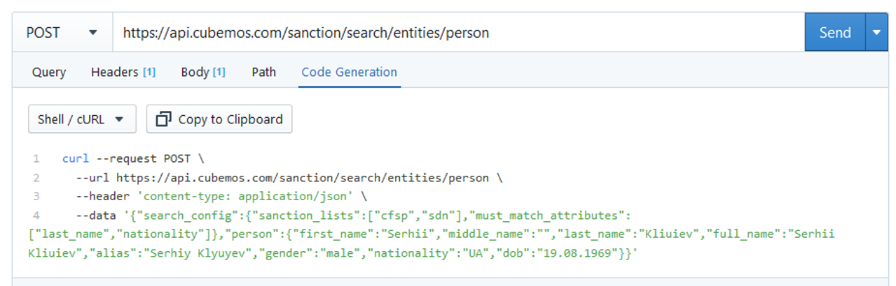

# Quick start

If you want to check out the possibilities of the cubemos sanction list api, you can test the individual endpoints of the api in the "Try it" sections. 

For a start, let's try to check if a specific person (in this case Fabio Enrique Ochoa Vasco) is under sanctions. 

In order to do so we will

- make a request to the [/search/entities/person](../swagger/sanctions_list.v1.yaml/paths/~1search~1location~1address/post) endpoint.
- use the result to get first-hand information from an official sanction list.

### Make a POST request

1. You can trigger the api by clicking `send` on the the element below.

```json http
{
  "method": "post",
  "url": "https://api.cubemos.com/sanction/search/entities/person",
  "headers": {
    "Content-Type": "application/json",
    "x-api-key": "sanction_api_cubemos"
  },
  "body": {
    "search_config": {
      "sanction_lists": [
        "cfsp",
        "SDN"
      ],
      "must_match_attributes": [
        "full_name"
      ]
    },
    "person": {
      "full_name": "OCHOA VASCO, Fabio Enrique",
      "first_name": "",
      "middle_name": "",
      "last_name": "",
      "aliases": [
        "Mario"
      ],
      "gender": "",
      "dob": "",
      "city": "",
      "nationality": ""
    }
  }
}
```
2. Inspect the response in case the was a person found. To retrieve the full original entry, you need to use the ID of the `list_entry_url` in a GET request. The example below uses the ID 10214 from the result of the above POST request and the SDN list as the original source.

```json http
{
  "method": "get",
  "url": "https://api.cubemos.com/sanction/list/sdn/10214",
   "headers": {
    "x-api-key": "sanction_api_cubemos"
  }
}
```

### Workflow of integration

1. Get your personal API Key from cubemos 
2. Make a POST request to search for sanctions opposed to a [person](../swagger/sanctions_list.v1.yaml/paths/~1search~1entities~1person/post), an [organization](../swagger/sanctions_list.v1.yaml/paths/~1search~1entities~1organization/post) or an [address](../swagger/sanctions_list.v1.yaml/paths/~1search~1location~1address/post)
3. Go to code generation tab
4. Select your development language of choice
5. Copy the generated code and paste into your project




