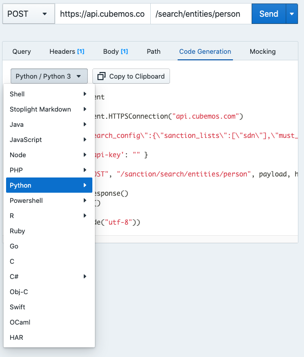

# How to integrate

1. Get your personal API Key from cubemos 
2. Make a POST request to search for sanctions opposed to a [person](../swagger/sanctions_list.v1.yaml/paths/~1search~1entities~1person/post), an [organization](../swagger/sanctions_list.v1.yaml/paths/~1search~1entities~1organization/post) or an [address](../swagger/sanctions_list.v1.yaml/paths/~1search~1location~1address/post)
3. If necessary, make a GET request to get the original entry from the [CFSP](../swagger/sanctions_list.v1.yaml/paths/~1list~1cfsp~1{id}/get) or [SDN](../swagger/sanctions_list.v1.yaml/paths/~1list~1sdn~1{id}/get) sanction lists 
4. Go to code generation tab
5. Select your development language of choice
6. Copy the generated code as in the image shown below and paste into your project

